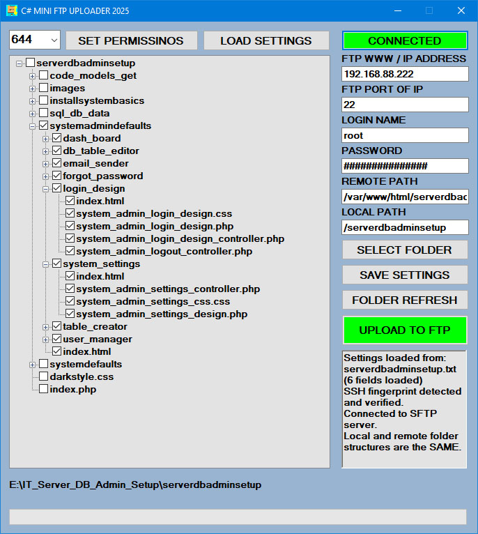

# C# MINI FTP UPLOADER 2025

A professional Windows Forms application for secure file transfer via SFTP protocol, built with C# and WinSCP.NET library.

## 📸 Application Screenshot


*Add your application screenshot here*

## 🚀 Features

- **Secure SFTP Connection**: Connect to SFTP servers with automatic SSH fingerprint detection
- **User-Friendly Interface**: Modern Windows Forms UI with intuitive controls
- **File Upload**: Upload entire folders and files to remote SFTP servers
- **Settings Management**: Save and load connection settings with password encoding
- **Real-time Feedback**: Live upload progress and detailed status messages
- **Error Handling**: Comprehensive error handling with clear user feedback
- **Input Validation**: Robust validation for all connection parameters
- **Auto-scroll Logs**: Automatic scrolling in the message log for better user experience

## 🛠️ Technologies Used

- **Framework**: .NET Framework (Windows Forms)
- **Language**: C# 
- **SFTP Library**: WinSCP.NET 6.5.2
- **UI**: Windows Forms with modern dialog styles

## 📋 Requirements

- Windows OS (7, 8, 10, 11)
- .NET Framework 4.0 or higher
- WinSCP.NET library (included via NuGet)

## 🎯 How to Use

### 1. Connection Setup
- **Host**: Enter the SFTP server hostname or IP address
- **Port**: Default is 22 (standard SFTP port)
- **Username**: Your SFTP username
- **Password**: Your SFTP password
- **Remote Path**: Target directory on the SFTP server

### 2. Local Folder Selection
- Click "SELECT PATH LOCAL" to choose the folder you want to upload
- Uses modern Windows Explorer-style folder selection

### 3. Save/Load Settings
- **Save Settings**: Save your connection details to a file (password is Base64 encoded)
- **Load Settings**: Load previously saved settings from a file

### 4. Upload Process
- Click "CONNECT" to establish SFTP connection
- Button turns green when connected successfully
- Click "UPLOAD" to start transferring files
- Monitor progress in the real-time log

## 🔧 Installation

1. Clone or download this repository
2. Open the solution in Visual Studio
3. Restore NuGet packages (WinSCP.NET will be downloaded automatically)
4. Build and run the project

## 📦 Project Structure

```
C_SHARP_MNI_FTP_UPLOADER_2025/
├── Form1.cs                 # Main application form and logic
├── Form1.Designer.cs        # UI design file
├── Form1.resx              # Form resources
├── Program.cs              # Application entry point
├── App.config              # Application configuration
├── packages.config         # NuGet package references
├── Properties/             # Assembly information and resources
├── bin/                    # Compiled binaries
├── obj/                    # Build artifacts
└── packages/               # NuGet packages (WinSCP)
```

## 🔐 Security Features

- **SSH Fingerprint Verification**: Automatic detection and verification of server fingerprints
- **Password Encoding**: Settings files store passwords using Base64 encoding (basic protection)
- **Secure Protocol**: Uses SFTP (SSH File Transfer Protocol) for encrypted file transfers
- **Connection Timeout**: 30-second timeout to prevent hanging connections

## 🎨 User Interface

- **Modern Dialogs**: Uses Windows Explorer-style file/folder selection
- **Visual Feedback**: Button color changes (green for connected, default for disconnected)
- **Real-time Logging**: Auto-scrolling rich text box shows all operations and status
- **Clear Error Messages**: Detailed error reporting for troubleshooting

## 📝 Key Functions

### Connection Management
- "GetSshHostKeyFingerprint()": Scans and retrieves SSH fingerprint
- "button1_Click()": Handles connect/disconnect operations
- Input validation for all connection parameters

### File Operations
- "button2_Click()": Manages file upload process
- "button4_Click()": Local folder selection
- Progress tracking and error reporting

### Settings Management
- "button3_Click()": Save settings to file
- "button5_Click()": Load settings from file
- "EncodePassword()" / "DecodePassword()": Basic password protection

## 🐛 Error Handling

The application includes comprehensive error handling for:
- Network connection issues
- Invalid server credentials
- File system errors
- Invalid input parameters
- SSH fingerprint mismatches

## 🚀 Future Enhancements

- [ ] Progress bar for large file uploads
- [ ] Resume interrupted transfers
- [ ] Multiple server profiles
- [ ] Drag-and-drop file selection
- [ ] Stronger password encryption
- [ ] Download functionality
- [ ] File synchronization

## 📄 License

This project is open source. Feel free to use and modify as needed.

## 👨‍💻 Author

Created with ❤️ using C# and WinSCP.NET

---

**Note**: Make sure to have proper SFTP server credentials before testing the application. The app includes timeout and error handling to gracefully manage connection issues.
